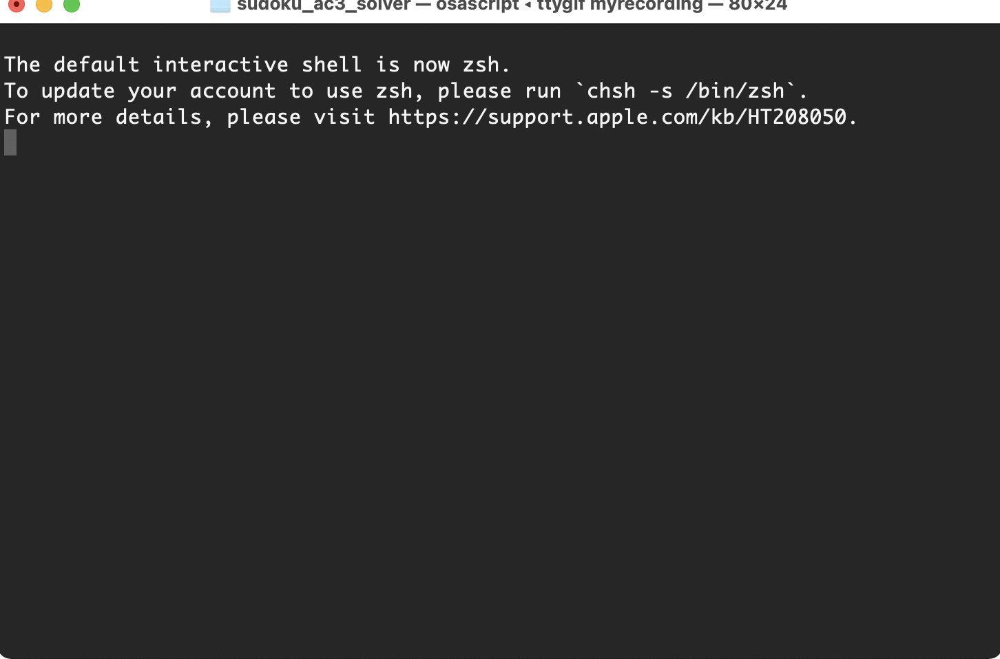

# sudoku_ac3_solver
This python based program solves any 9x9 sudoku game through the AC3 algorithm by constrains satisfactions.

This is an academic project and for that same reason you might find the code lacking some possible optimizations.

# Usage

# Project Needs/Requirements

1. Use the AC3 algorithm based on constrains satisfactions.
2. 9X9 sudoku's.
3. Python as base language.

Input:

Expected output:

