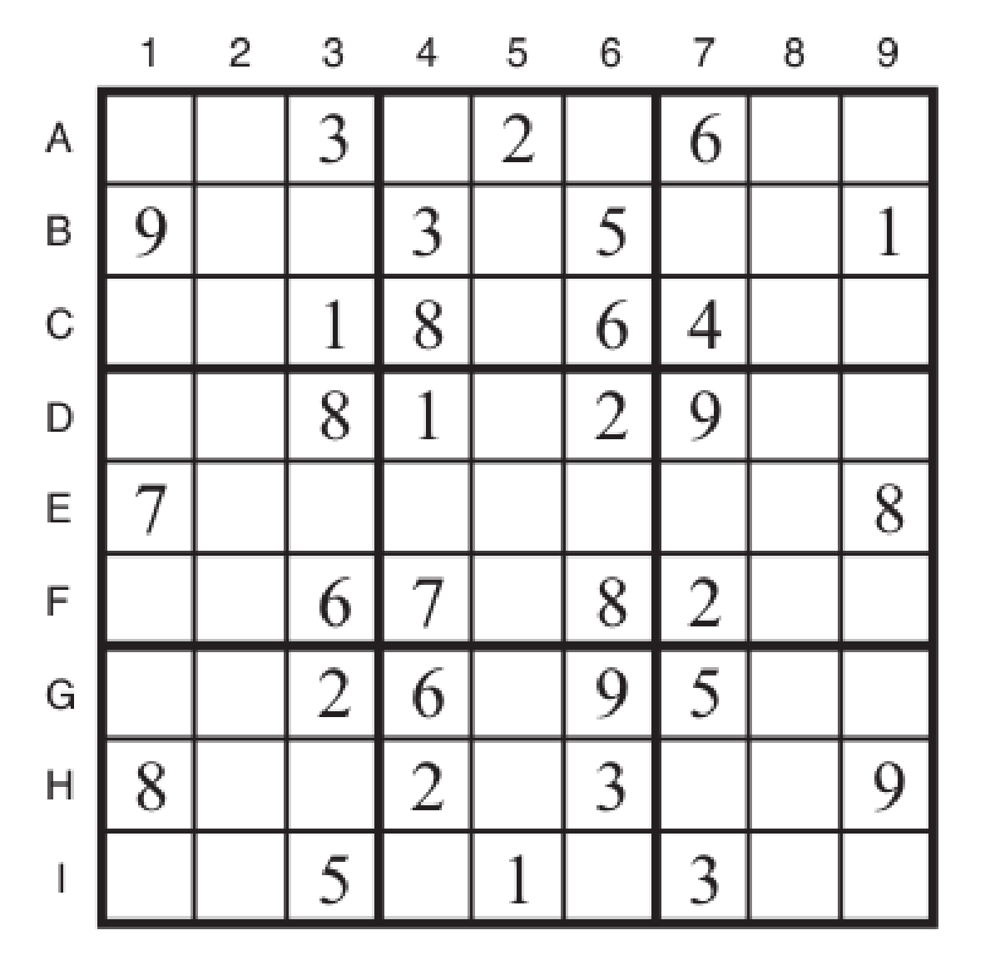
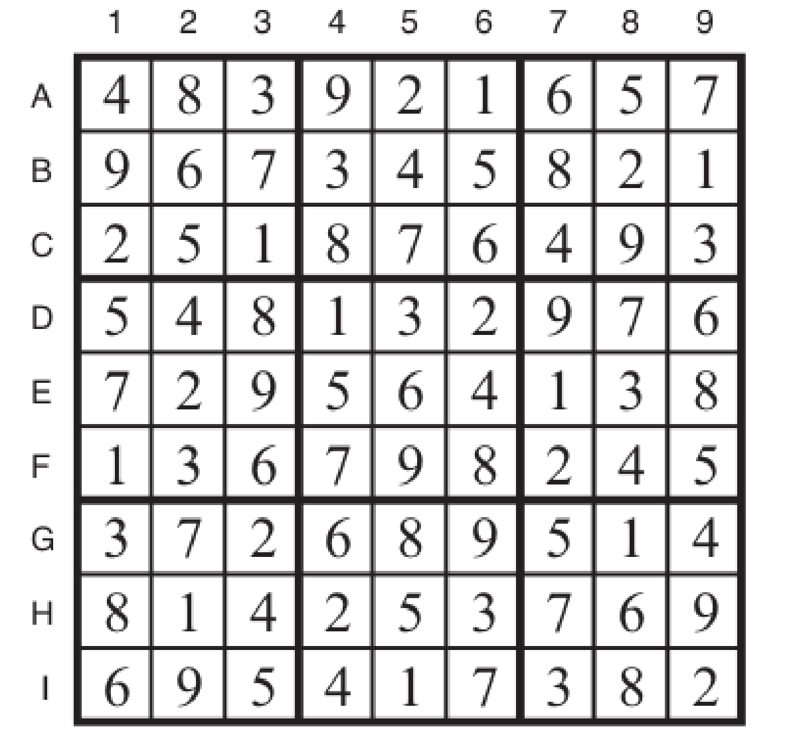

# sudoku_ac3_solver
This python based program solves any 9x9 sudoku game through the AC3 algorithm by constrains satisfactions.

This is an academic project and for that same reason you might find the code lacking some possible optimizations.

The project defined sudoku to be solved is:

The resolution is:

